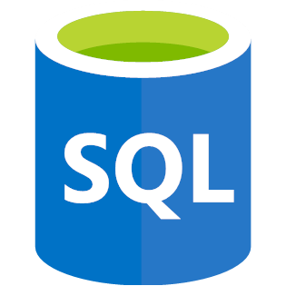

## Hi there, I'm Lauren!
I am a Nashville based software engineer with a passion for problem solving and creating applications that make a difference in the lives of users. When I'm not coding, I enjoy reading a good book, listening to music, drawing and painting, writing, spending quality time with my friends and family, watching a beautiful sunset, and trying Chai Lattes at every new coffee shop I can find. ☕️☀️🦒📝🎶🎨📚  

## About Me
Before software development, I attended college for Computer Networking, while working as an Administrative Assistant. I have always been the person that everyone in my family comes to for their technological needs and I love the challenge of figuring out why a computer isn't working properly. Because of this, I thought I wanted to spend my life troubleshooting hardware and software computer issues. 

However, during college, I took a few programming classes and they really sparked my interest, making me realise that I absolutely loved coding. Fast forward a year and I had graduated college, that's when a friend told me more about Nashville Software School's Web Development Bootcamp. It sounded like an amazing opportunity to learn about
something I love and turn it into a career that I would enjoy for a lifetime, so I took the plunge and enrolled in the program.
I have loved every minute that I've spent programming ever since. I love how software development allows me to practicing problem
solving, collaborate with teammates and build relationships, constantly learn new things, and of course, write code and build applications!
Coding is exactly where I need to be.

## What tech do I work with?

&nbsp&nbsp&nbsp&nbsp&nbsp&nbsp&nbsp&nbsp&nbsp&nbsp&nbsp&nbsp&nbsp&nbsp&nbsp&nbsp&nbsp&nbsp&nbsp&nbsp&nbsp&nbsp&nbsp&nbsp&nbsp&nbsp&nbsp&nbsp&nbsp&nbsp&nbsp&nbsp&nbsp&nbsp&nbsp&nbsp&nbsp&nbsp&nbsp&nbsp&nbsp&nbsp&nbsp&nbsp&nbsp&nbsp&nbsp&nbsp

&nbsp&nbsp&nbsp&nbsp&nbsp&nbsp&nbsp&nbsp&nbsp&nbsp&nbsp&nbsp&nbsp&nbsp&nbsp&nbsp&nbsp&nbsp&nbsp&nbsp&nbsp&nbsp&nbsp&nbsp&nbsp&nbsp&nbsp&nbsp&nbsp&nbsp&nbsp&nbsp&nbsp&nbsp&nbsp&nbsp&nbsp&nbsp&nbsp&nbsp&nbsp&nbsp&nbsp&nbsp&nbsp&nbsp&nbsp&nbsp

